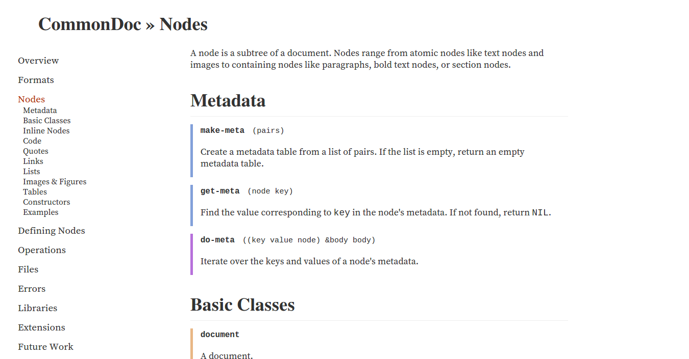

# Codex

[](https://travis-ci.org/CommonDoc/codex)
[](https://coveralls.io/r/CommonDoc/codex?branch=master)

A documentation system for Common Lisp.

# Overview

**Codex** generates documentation. You just write docstrings as usual, only
using [Scriba][scriba] syntax, append a couple of extra files (A few tutorials
and what have you), and Codex creates beautiful online documentation, and in the
near future, PDF manuals.

Codex uses [CommonDoc][commondoc] for representing the documentation and
converting it to other formats.

## Users

Libraries or applications that use Codex:

* [CommonDoc][commondoc]
* [Jonathan](https://github.com/Rudolph-Miller/jonathan)
* [cl-bson](https://github.com/EuAndreh/cl-bson)
* [Lucerne](http://eudoxia.me/lucerne/)
* [cl-gists](https://github.com/Rudolph-Miller/cl-gists)
* [cl-annot-prove](https://github.com/Rudolph-Miller/cl-annot-prove)

# Usage

## Macros

### `cl:with-package`

Sets the current package for node insertion. See below.

### `cl:doc`

Insert the documentation of a symbol. For example, if your app defines a class
`my-class` in the package `pack`, the following invocation will expand to class
documentation, including the docstring of the class itself, and documentation of
its slots:

```
@cl:with-package[name=pack](
  @cl:doc(class my-class)
)
```

### `cl:param`

Refers to an argument of a function, macro or method. For example

```
The @cl:param(list) argument holds...
```

# Themes

## Minima



Lovingly hand-picked local serifs trace that fine line between "I'm a free
spirit with a stoic personality" and "God save the Queen".

# Implementation

Codex uses [docparser][docparser] to extract documentation from systems, and
[Pandocl][pandocl] to parse docstrings and files into a CommonDoc document.

[scriba]: https://github.com/CommonDoc/scriba
[commondoc]: https://github.com/CommonDoc/common-doc
[clhs]: http://www.lispworks.com/documentation/HyperSpec/Front/
[docparser]: https://github.com/eudoxia0/docparser
[pandocl]: https://github.com/CommonDoc/pandocl

# License

Copyright (c) 2014-2015 Fernando Borretti

Licensed under the MIT License.
